# 

This bot provides a live feed into a discord channel of all the games being played in SaveMGO2/Metal Gear Online 2 (the online component to MGS4). It is a **work in progress** as a result it currently does not have error handling.

 

# Setting up the Discord Bot

There are 2 ways to setup my bot. You can either run it on my server (may change my mind if heavy traffic one day but would try to warn people in advance via the bot) or you can run this bot of your own server.

## Hosting from your own server

Copy the .py files and run the bot in your chosen code editor or server host as you would with any other bot. As far as I am aware message intentions are all that is required but the official bot I have has message, server member, and presence enabled. 
The only thing you are going to need to set this up is your bot token. Please see the image below: 

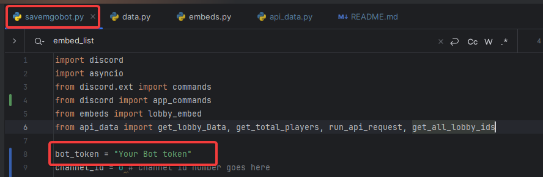

## Using my server for the bot

Simply click this [link](https://discord.com/api/oauth2/authorize?client_id=1175813240605913190&permissions=355344&scope=bot%20applications.commands) to invite the Discord bot to your server. That is it you have a lobby bot 😎.

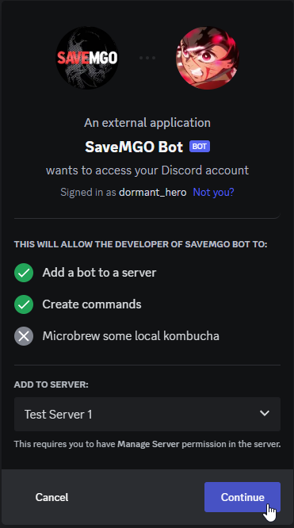

## Usage

You can follow this [video guide](https://youtu.be/bWCSD36b4AE) or follow the instructions below in relation to usage.

Once the bot is on your server create the discord channel you want the lobbies to be sent on (you can give it any name). 

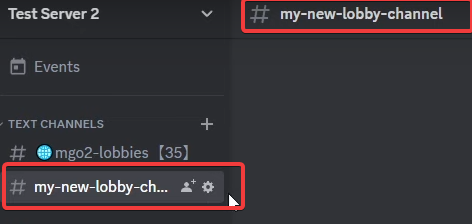

Once done I recommend you check the permissions of the channel and/or just ensure the bot has the necessary permissions. In my case I am using the below:

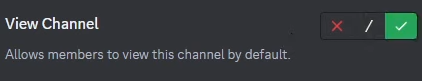

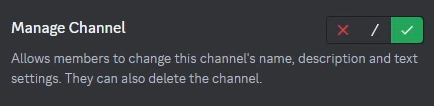

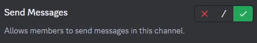

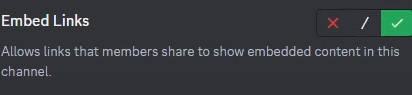

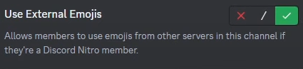

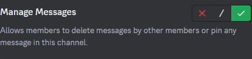

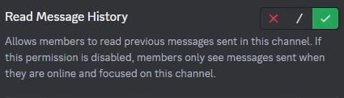

Now the permissions are set we just need to copy the channel id into the command /set_channel_id so the bot knows where 
you would like the lobby embeds posted for your server.

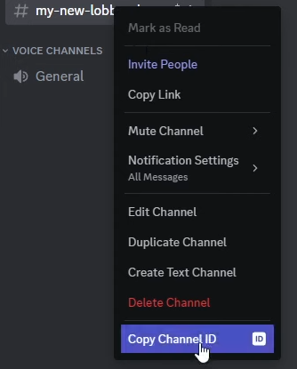

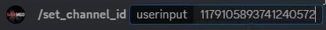

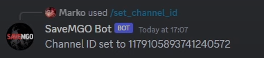

With our channel assigned simply type !startand you should find some nice lobby embeds being produced 😏.

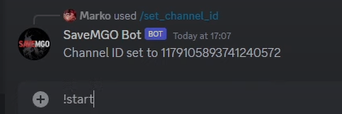

### Note if your running this of your own server

You can download the custom emojis like the ones you see in the below image from the SaveMGO discord @ discord.gg/mgo2pc 
then host them in your server or others with the bot located inside of them.

**Custom Emojis in the embed**

These images below shows you how to receive custom emoji codes for any emoji. Post the emoji from one of the servers your server is in 
and at a backslash \ in-front of it as per the below:

You will then receive this emoji code which can be pasted into the data.py.

